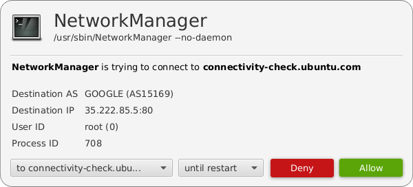

# AppFirewall

| WARNING: This is a prototype. |
| --- |

AppFirewall is a GNU/Linux desktop application firewall inspired by evilsocket's [OpenSnitch](https://github.com/evilsocket/opensnitch). AppFirewall uses eBPF to detect new outbound connections and tries to use XDP to control them.

## Use cases

You might want to try AppFirewall for the following use cases:

* Check if an application contains analytics.
* Check if your trusted dependencies communicate with the outside world.

## License
The AppFirewall Go code is licensed under the Apache License. The BPF code is licensed under GPL as some [BPF-helpers are GPL-only](https://github.com/iovisor/bcc/blob/master/docs/kernel-versions.md#helpers).

## Requirements
* x64 CPU(s)
* Recent Linux Kernel: 4.15 or later
* [Go](https://golang.org/)
* upstream [bpfcc-tools](https://github.com/iovisor/bcc/blob/master/INSTALL.md#ubuntu---binary)

## Installation
Step-by-Step instructions for Ubuntu 18.04.2 with Linux Kernel 4.18.

    # Install Go 1.11 or later (if not already installed)
    sudo snap install --classic go

    # Install Protobuf Compiler
    sudo apt install protobuf-compiler
    go get -u github.com/golang/protobuf/protoc-gen-go

    # Might need to add $GOPATH/bin to the PATH (make sure $GOPATH is set)

    # Add $GOPATH/bin to Path if it's not already set

    # Install Upstream BCC Tools for Ubuntu 18.04 (Bionic Beaver)
    sudo apt-key adv --keyserver keyserver.ubuntu.com --recv-keys 4052245BD4284CDD
    echo "deb https://repo.iovisor.org/apt/$(lsb_release -cs) $(lsb_release -cs) main" | sudo tee /etc/apt/sources.list.d/iovisor.list
    sudo apt update
    sudo apt install bcc-tools libbcc-examples linux-headers-$(uname -r)

    # Change into a folder of your choice and clone AppFirewall
    git clone https://github.com/appfirewall/appfirewall.git

    cd appfirewall

    # Get latest AS data
    ./updateASData.sh
    
    go generate
    go build

## Running:

    sudo ./appfirewall

## User Interface

[AppFirewall FX UI](https://github.com/appfirewall/appfirewall-fx-ui) tries to be the first user interface for AppFirewall.

## Development

### Autonomous System (AS) Information

AS data of [IPtoASN](https://iptoasn.com/) is used.
The local AS-Number lookup will require some more RAM.

To update the AS data used while developing run:

    ./updateASData.sh

### Tests
Run tests:

    go test ./...

### IDE
[VS Code](https://code.visualstudio.com/) can be used for development. The committed `settings.json` file highlights `*.bpf` files as C files.
